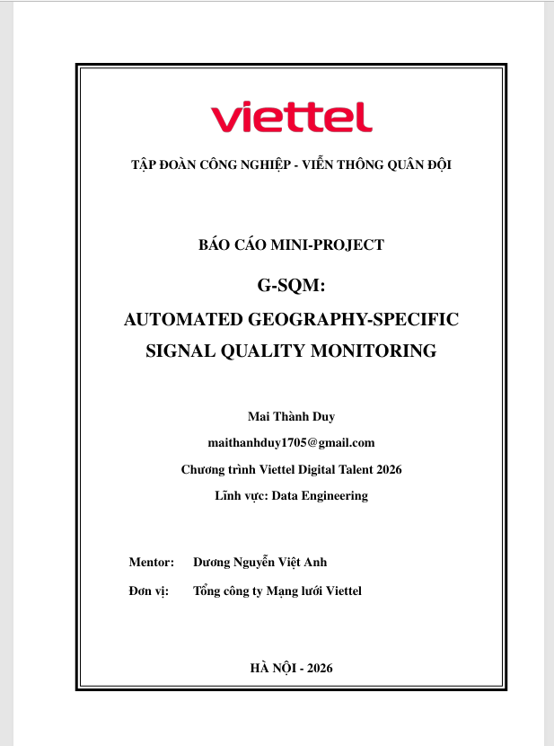

# VDT 2026: G-SQM - Automated Geography-Specific Signal Quality Monitoring
*(Giám sát tự động chất lượng vùng phủ tín hiệu chuyên biệt tới từng phân vùng địa lý)*
---

##  Thông tin đề tài (Project Information)
* **Chương trình:** Viettel Digital Talent (VDT) 2026.
* **Lĩnh vực:** Thực tập sinh Kỹ sư Dữ liệu (Data Engineering).
* **Học viên:** Mai Thành Duy.
* **Mentor hướng dẫn:** Dương Nguyễn Việt Anh.
* **Đơn vị:** Tổng công ty Mạng lưới Viettel (VTNet).
* **Mã dự án / Thư mục nguồn:** `vdt-de-gd1`.

---

##  Tổng quan đề tài (Project Overview)
Đề tài được thực hiện trong khuôn khổ chương trình Viettel Digital Talent (VDT) 2026, nhằm giải quyết bài toán giám sát vùng phủ chất lượng tín hiệu của Tổng công ty Mạng lưới Viettel (VTNet). Đây là hệ thống đầu tiên tại VTNet có thể giám sát tự động chất lượng vùng phủ tín hiệu chuyên biệt tới từng phân vùng địa lý.

Hệ thống tập trung giải quyết 2 bài toán chính:
* **1. Bài toán Tự động giám sát (Automated Monitoring):**
  * **Input:** Dữ liệu log MDT (Minimization of Drive Tests) và thông tin trạm phát.
  * **Output:** Xác định chính xác trạng thái của từng ô lưới không gian H3. Tự động cảnh báo các phân vùng có chất lượng sóng yếu qua các thông tin về Chất lượng tín hiệu và Mật độ người dùng.
* **2. Bài toán Dự báo và Cảnh báo sớm (Early Warning):**
  * **Input:** Chuỗi thời gian lịch sử về chất lượng tín hiệu và mật độ tại các ô lưới H3.
  * **Output:** Dự báo biến động trong 24 giờ tiếp theo để đưa ra cảnh báo sớm cho các phân vùng H3 có chất lượng tệ. Danh sách cảnh báo này giúp hỗ trợ sự can thiệp tối ưu kịp thời của các kỹ sư.

Bằng cách ứng dụng kiến trúc Data Lakehouse và hệ thống chỉ mục không gian lưới lục giác (H3), hệ thống tự động hóa toàn bộ quy trình vận hành. Luồng tự động bao gồm: thu thập dữ liệu log MDT và dữ liệu trạm phát sóng (Cell), kiểm soát chất lượng dữ liệu, nội suy không gian, thiết kế mô hình dữ liệu lưu trữ, và chạy mô hình Machine Learning (Prophet) để dự báo chất lượng tín hiệu và mật độ người dùng[cite: 2]. Kết quả được trực quan hóa nhằm hỗ trợ các kỹ sư tối ưu hóa chất lượng tín hiệu một cách chủ động[cite: 2].

---

##  Công nghệ sử dụng (Tech Stack)
* **Data Processing:** Apache Spark (PySpark) để thực thi tính toán phân tán trong bộ nhớ tốc độ cao
* **Orchestration & Workflow:** Apache Airflow để điều phối và lập lịch các luồng công việc tự động theo chu kỳ.
* **Data Lakehouse / Query Engine:** Hive Metastore (Metadata Catalog) & Trino (Distributed SQL Query Engine).
* **Storage Layer:** MinIO S3 (Object Storage) kết hợp định dạng mở Delta Lake đảm bảo giao dịch ACID.
* **Spatial Indexing:** H3 (Uber's Hexagonal Hierarchical Spatial Index) để mã hóa không gian thành các phân vùng lục giác.
* **Data Quality Checking:** Great Expectations (GX) để kiểm tra hợp lệ, loại bỏ dữ liệu lỗi và cô lập dị biệt tọa độ GPS.
* **Machine Learning:** Prophet (Meta) để phân tích chuỗi thời gian và dự báo đa biến theo chu kỳ.
* **Frontend / Dashboard:** Streamlit kết hợp thư viện Kepler.gl (WebGL 3D map) và Chart.js.
* **Infrastructure & Deployment:** Docker và Docker Compose để container hóa và khởi chạy đồng bộ toàn bộ hệ thống.

---

##  Cấu trúc dự án (Repository Structure)
Hệ thống được đóng gói hoàn toàn bằng Docker nằm trong thư mục gốc `vdt-de-gd1/`, được chia thành các phân hệ lõi như sau:

* **`dags/`**: Quản lý lịch trình và luồng công việc tự động (Airflow DAGs).
  * `6_mdt_pipeline_dag.py`: DAG điều phối toàn bộ Pipeline chính xử lý dữ liệu log MDT.
  * `dag_daily_dim_cell.py`: DAG cập nhật thông tin chiều (Dimension) của các trạm Cell khi cần cập nhật (SCD Type 1).
  * `forecast_dag.py`: DAG kích hoạt mô hình dự báo chất lượng tín hiệu và mật độ người dùng.
  * `mdt_email_alert_dag.py`: DAG quản lý luồng gửi email tự động cảnh báo phân vùng địa lý có chất lượng tệ.
* **`spark_scripts/`**: Mã nguồn lõi xử lý dữ liệu lớn bằng PySpark.
  * `0a_init_dim_date.py`: Tạo bảng Date Dimension phục vụ truy vấn theo chuỗi thời gian.
  * `0b_init_dim_h3.py`: Khởi tạo bảng Dimension không gian theo chuẩn H3 Resolution.
  * `0_ingest_cell.py`: Đổ dữ liệu danh mục trạm phát sóng (Cell Info) vào MinIO.
  * `1_ingest_data.py`: Xử lý luồng dữ liệu log MDT thô đưa vào Bronze layer.
  * `2_quality_check.py`: Đánh giá Data Quality và loại bỏ dữ liệu nhiễu/lỗi đưa vào Silver layer.
  * `3_h3_enrichment.py`: Thực hiện song song quy trình Làm giàu dữ liệu (Enrichment) (gắn chỉ mục H3 Resolution 9 dựa trên tọa độ thiết bị, tính toán khoảng cách địa lý km tới trạm phát bằng công thức Haversine) và Ánh xạ dữ liệu (Mapping) (Point-in-Time Broadcast Join dữ liệu đo kiểm với danh mục trạm dim_cell và tổng hợp trực tiếp thành mô hình dữ liệu Fact hoàn chỉnh fact_mdt_hourly tại tầng Gold).
  * `5_push_to_postgis.py`: Kết nối Trino API để tự động kiểm tra, khởi tạo schema và đăng ký (register) cấu trúc metadata của các bảng Delta từ S3 (MinIO) lên Metastore lần đầu tiên.
  * `6_forecast.py`: Thực thi mô hình dự báo chất lượng tín hiệu và mật độ người dùng với dữ liệu đầu vào là 7 ngày liền trước của từng Cell/H3.
  * `6b_evaluate.py`: Đánh giá độ chính xác (Accuracy/Error) của mô hình.
  * `7_app_streamlit.py`: Khởi chạy Web Dashboard trực quan hóa bản đồ và biểu đồ (Trino truy vấn từ Hive metastore).
  * `8_register_forecast.py`: Lưu trữ cấu hình và kết quả của mô hình tối ưu nhất xuống Fact forecast hourly và đăng ký bảng với Hive metastore.
* **`trino_etc/`**: Cấu hình Data Catalog cho Trino để tích hợp Lakehouse (chứa file `catalog/lakehouse.properties`).
* **`Dockerfile.*`**: Cụm script để build images cho các môi trường (`Dockerfile.airflow`, `Dockerfile.metastore`, `Dockerfile.spark`, `Dockerfile.streamlit`).
* **`docker-compose.yml`**: Tệp cấu hình khởi chạy toàn bộ cụm dịch vụ nội bộ dưới nền.
* **`requirements.txt`**: Tệp định nghĩa các gói thư viện Python phụ thuộc.

---

## Quy trình luồng dữ liệu (Data Pipeline Flow)
Luồng xử lý dữ liệu được thiết kế chặt chẽ theo các bước sau nhằm đảm bảo chất lượng dữ liệu phục vụ bài toán SQM[cite: 2]:

* **Khởi tạo (Initialization):**
  * `0a_init_dim_date.py`: Tạo bảng Date Dimension phục vụ truy vấn theo chuỗi thời gian.
  * `0b_init_dim_h3.py`: Khởi tạo bảng Dimension không gian theo chuẩn H3 Resolution để ánh xạ vùng phủ sóng.
* **Thu thập dữ liệu (Ingestion):**
  * `0_ingest_cell.py`: Đổ dữ liệu danh mục trạm phát sóng (Cell Info) vào Bronze .
  * `1_ingest_data.py`: Xử lý luồng dữ liệu log MDT thô kéo từ máy chủ SFTP về vùng lưu trữ MinIO.
* **Làm sạch & Làm giàu dữ liệu (Quality & Enrichment):**
  * `2_quality_check.py`: Đánh giá Data Quality theo 5 tiêu chuẩn của Great Expectations. Tác vụ tự động loại bỏ dữ liệu nhiễu và cách ly các bản ghi lỗi tọa độ từ các Cell.
  * `3_h3_enrichment.py`: Thực hiện song song quy trình Làm giàu dữ liệu (Enrichment) (gắn chỉ mục H3 Resolution 9 dựa trên tọa độ thiết bị, tính toán khoảng cách địa lý km tới trạm phát bằng công thức Haversine) và Ánh xạ dữ liệu (Mapping) (Point-in-Time Broadcast Join dữ liệu đo kiểm với danh mục trạm dim_cell và tổng hợp trực tiếp thành mô hình dữ liệu Fact hoàn chỉnh fact_mdt_hourly tại tầng Gold)..
* **Lớp phục vụ truy vấn (Serving Layer):**
  * `5_push_to_postgis.py`: Kết nối Trino API để tự động kiểm tra, khởi tạo schema và đăng ký (register) cấu trúc metadata của các bảng Delta từ S3 (MinIO) lên Metastore lần đầu tiên.
* **Dự báo chất lượng dịch vụ (SQM Forecasting):**
  * `6_forecast.py`: Thực thi mô hình dự báo chuỗi thời gian Prophet cho lưu lượng và cường độ sóng của từng Cell/H3.
  * `6b_evaluate.py`: Đánh giá độ chính xác (MAE, RMSE) của mô hình.
  * `8_register_forecast.py`: Lưu trữ cấu hình và kết quả của mô hình tối ưu nhất vào Hive Metastore.
* **Trực quan hóa (Presentation):**
  * `7_app_streamlit.py`: Khởi chạy Web Dashboard cho phép bộ phận vận hành theo dõi bản đồ nhiệt (Heatmap) và biểu đồ dự báo.

---

##  Hướng dẫn triển khai (Getting Started)

### 1. Yêu cầu hệ thống (Prerequisites)
* Máy chủ đã cài đặt đầy đủ Docker và Docker Compose.
* Cấp quyền thực thi cho các tệp lệnh và mở các Port theo đúng cấu hình trong tệp `docker-compose.yml`.

### 2. Khởi chạy hệ thống
Thực hiện các lệnh dưới đây trong Terminal tại thư mục `vdt-de-gd1/`:

```bash
# Xây dựng các images từ Dockerfile
docker-compose build

# Khởi chạy toàn bộ hệ thống Pipeline và Dashboard dưới nền
docker-compose up -d
```
### 3. Truy cập hệ thống 

Airflow UI: Theo dõi DAGs điều phối dữ liệu viễn thông tại http://localhost:<airflow_port>.

Trino UI: Truy vấn SQL Engine tốc độ cao tại http://localhost:<trino_port>.

G-SQM Dashboard: Giám sát chất lượng mạng trực quan và bản đồ H3 tại http://localhost:<streamlit_port>


##  Tài liệu đính kèm

Bấm vào ảnh dưới đây để xem chi tiết file báo cáo PDF:

[](./docs/VDT26_G_SQM_Mai_Thành_Duy.pdf)
